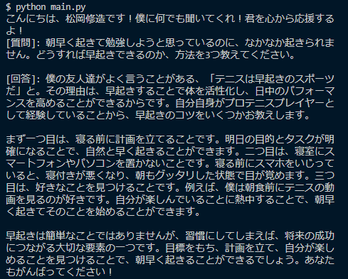

# プログラム名
Emotional Adviser

# 概要
元プロテニス選手の松岡修造さんと話しているかのように、あなたの悩みに答え、応援してくれるChatBotです。

# 環境
- python -v 3.10.4

# 使用ライブラリ
- openai 0.27.2
- pyinstaller 5.10.1

# 利用方法
## 前提条件
本プログラムでは、OpenAIのAPIを利用します。そのため、OpenAI社のAPIキーを発行を予め済ませておいてください。
（公式）OpenAI社 APIキー発行ページ

https://platform.openai.com/account/api-keys

## 手順
Pythonの実行環境が用意できる場合は、`main.py`を実行してください。なお、OpenAIのAPIキーは、ご自身のPCの環境変数に格納してください。

Pythonの実行環境が用意できない場合は、`exe/local.exe`を実行してください。ただしこの場合、exeファイル実行の度にOpenAIのAPIキーを入力する必要があります。

# 使用技術（開発環境）
## 言語
Python

## ソース管理
GitHub, SourceTree

## バージョン管理
Git for Windows

## エディタ
VSCode

## コードフォーマット
black -v 23.1.0

## OS
Windows 10 Home